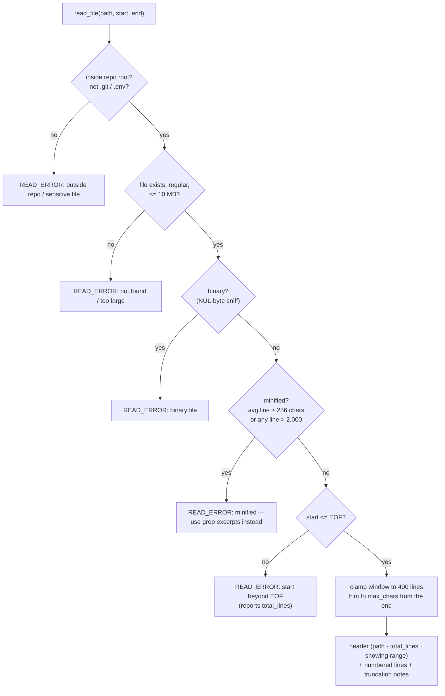
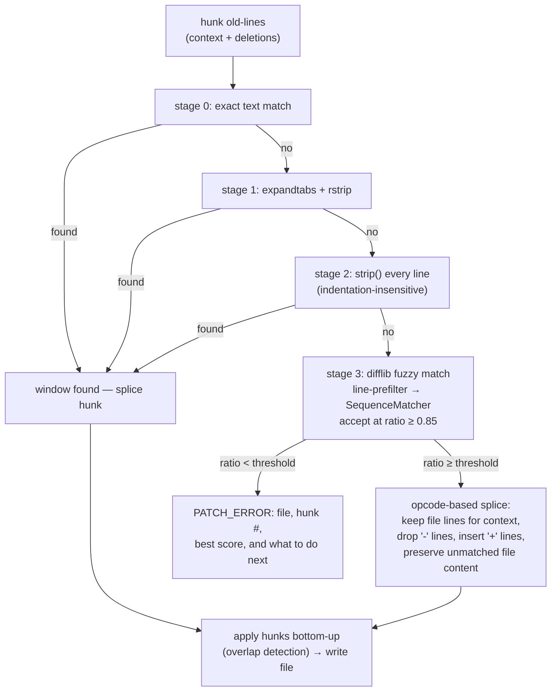
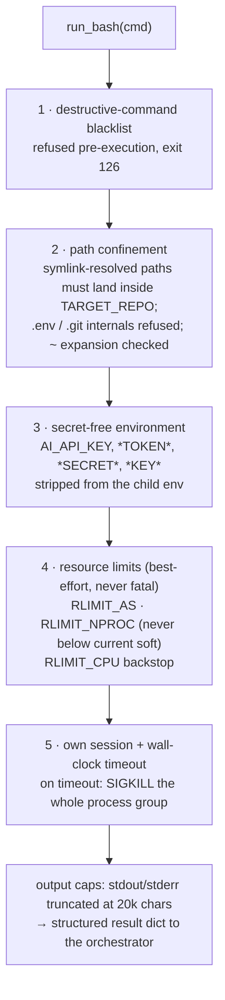
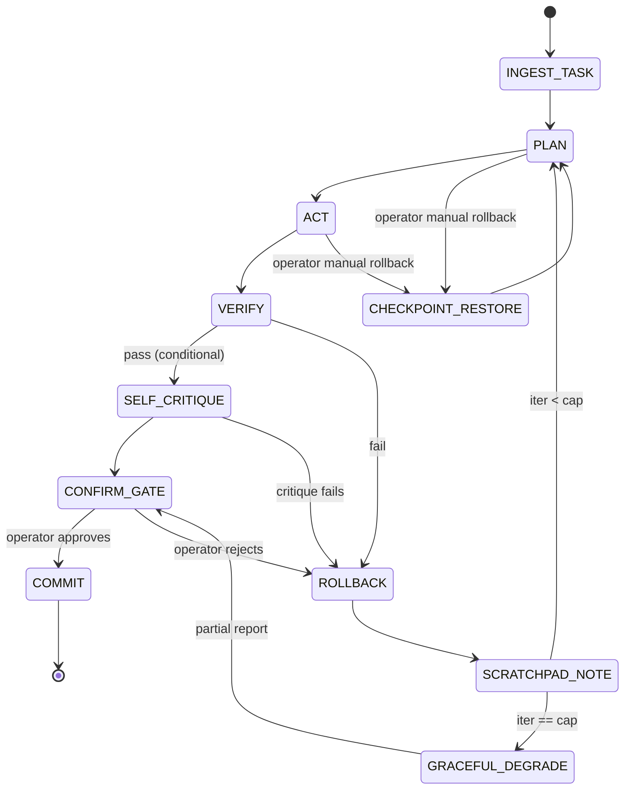
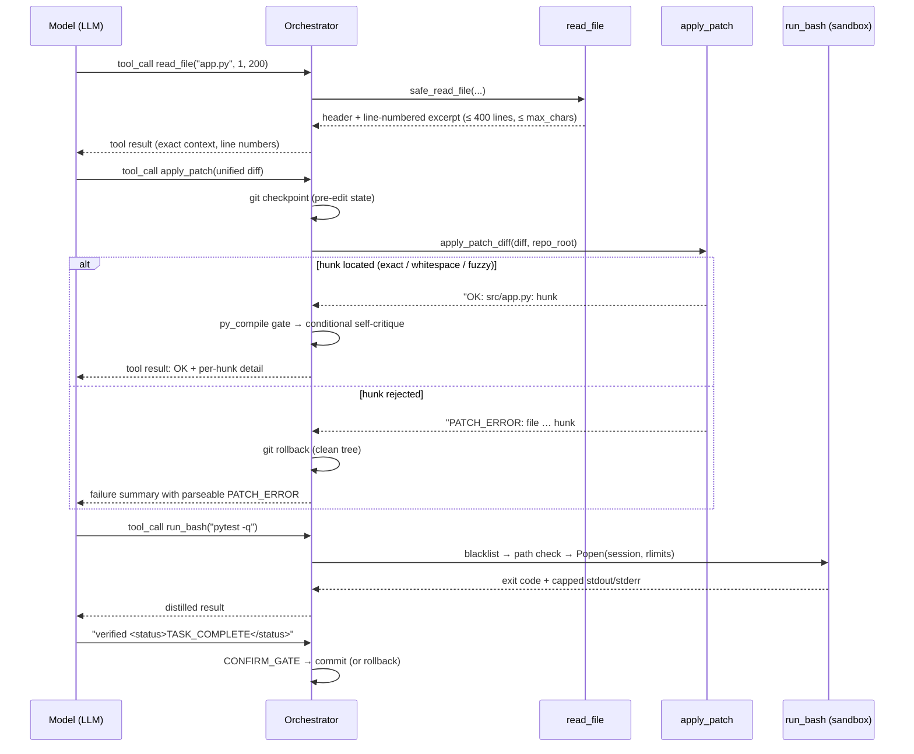

# Otsutsuki — Proof-First AI Coding Harness

[](https://github.com/kushalrathore19/Otsutsuki/actions/workflows/ci.yml)


An autonomous, single-agent coding harness built for the **AI Harness Hackathon 2026**. It takes a standardized, text-only foundation model and turns it into a software engineer that can navigate a repository, read code safely, apply patches, run tests, recover from failures, and prove — not just claim — that a task is done.

Design philosophy: **deterministic execution, auditable evidence, strict resource management.** No hidden state, no unverifiable claims, no silent failures.

---

## Table of contents

- [What it can do](#what-it-can-do)
- [The three failure modes it fixes](#the-three-failure-modes-it-fixes)
- [Quickstart](#quickstart)
- [Fixing a GitHub issue end-to-end](#fixing-a-github-issue-end-to-end)
- [Configuration](#configuration)
- [The three tools](#the-three-tools)
  - [`read_file` — safe context reader](#read_file--safe-context-reader)
  - [`apply_patch` — fuzzy patch applier](#apply_patch--fuzzy-patch-applier)
  - [`run_bash` — sandboxed executor](#run_bash--sandboxed-executor)
- [Architecture](#architecture)
- [Control flow (state machine)](#control-flow-state-machine)
- [A typical turn](#a-typical-turn)
- [Lessons from a real failure](#lessons-from-a-real-failure)
- [Context & environment management](#context--environment-management)
- [Optimization layer](#optimization-layer)
- [Sandbox isolation](#sandbox-isolation)
- [Human-in-the-loop: Mission Control TUI](#human-in-the-loop-mission-control-tui)
- [Metrics tracked](#metrics-tracked)
- [Evidence & artifacts](#evidence--artifacts)
- [Multi-Agent Mode](#multi-agent-mode)
- [Testing & CI](#testing--ci)
- [Hackathon compliance](#hackathon-compliance)
- [Project structure](#project-structure)
- [Security](#security)
- [Known limitations](#known-limitations)
- [Roadmap & license](#roadmap--license)
- [Further reading](#further-reading)

---

## What it can do

Give it a task in plain English (or a GitHub issue URL) and a target repository, and it will:

- **Localize** the relevant code with a static analysis pass (`grep` + Python `ast`) before the loop starts.
- **Read** files through a range-limited, minification-aware reader that prints line numbers and can never flood the context window.
- **Edit** files exclusively via fuzzy-matched unified diffs that tolerate whitespace drift, stale line numbers, and markdown fences.
- **Verify** its work: `py_compile` syntax gate → existing test suite → model-authored regression test → conditional self-critique.
- **Recover** on its own: escalating retry guidance, context pruning, checkpoint/rollback via git.
- **Prove** the outcome: every run writes `TASK.md`, `status.json`, `events.jsonl`, and a final `OUTCOME.md`.

---

## The three failure modes it fixes

Autonomous coding agents die in three predictable ways. Each has a dedicated, hardened component in `src/`:

| Failure mode | What it looks like | The fix |
|---|---|---|
| **Fragile diff application** | The model hallucinates whitespace or context lines; the Unix `patch` utility hard-fails; the iteration budget burns on retries. | [`src/patcher.py`](./src/patcher.py) — a fuzzy diff applier with staged matching and machine-parseable errors. |
| **Context window blowouts** | The model `cat`s a minified JS bundle or a 10,000-line monolith and the context budget is gone. | [`src/safe_reader.py`](./src/safe_reader.py) — a range-based reader that refuses minified/binary files and caps output. |
| **Unsafe execution** | A single stateless `run_bash` lets the model `rm -rf /`, delete `.git`, or fork-bomb the machine. | [`src/sandbox.py`](./src/sandbox.py) — blacklist + repo confinement + process-group timeout + rlimits. |

These are not theoretical. The original harness lost 5 of 8 iterations on a trivial task before these components existed — see [Lessons from a real failure](#lessons-from-a-real-failure).

---

## Quickstart

```bash
git clone https://github.com/kushalrathore19/Otsutsuki.git
cd Otsutsuki
export AI_API_KEY="your-api-key"
make setup
make run
```

`make run` launches a chat-style terminal interface (Textual). Type a task and press **Enter** — the agent starts working immediately. That's the scored minimum bar: `make setup && make run` succeed with **zero manual steps** on a clean checkout.

For a fully non-interactive run (used by the hackathon evaluator):

```bash
export AI_API_KEY="<provided-key>"
export AUTO_APPROVE=1
export TASK="Fix the null pointer exception in the auth middleware"
make run
```

### Operating on another repository

Otsutsuki operates on the repository pointed to by `TARGET_REPO` (defaults to its own checkout):

```bash
TARGET_REPO=/path/to/your/local/clone make run
```

Interactive features: typing while the agent works injects a **nudge** into its next turn; the confirmation gate pauses before any commit (`yes`/`no`); slash commands `/rollback`, `/new`, `/history`, `/quit` are available in the same input box.

---

## Fixing a GitHub issue end-to-end

Paste a GitHub issue/PR URL (or plain task text) into the prompt, or pass it via `TASK`:

```bash
TARGET_REPO=/path/to/your/local/clone \
TASK="Please fix the bug reported here: https://github.com/owner/repo/issues/123" \
make run
```

What happens next:

1. The ingestion engine recognizes the GitHub URL and fetches the issue's title, description, and comments from the GitHub API.
2. That context is bundled with the task and handed to the LLM agent.
3. The agent locates the relevant files with `grep` and `read_file`, reproduces the bug, and proposes a diff.
4. The patch is verified against the test suite plus a regression test the agent writes for the specific issue.
5. The diff and `OUTCOME.md` summary are presented at `CONFIRM_GATE` — nothing is committed until you approve it.

**Private repositories:** `export GITHUB_TOKEN=your_personal_access_token`. The token is used only to fetch issue/PR content over the API — it is never passed into the sandboxed shell the model controls, never written to disk, and never appears in evidence files.

---

## Configuration

All configuration is via environment variables — nothing is hardcoded in source. Set them directly or in a `.env` file at the repo root (see `.env.example`).

| Variable | Default | Description |
|---|---|---|
| `AI_API_KEY` | *(required)* | Model API credential. Never committed, never logged, stripped from every sandboxed subprocess's environment. |
| `AI_MODEL` | `openai/gpt-oss-20b` | Model identifier, swappable without touching source code. |
| `AI_BASE_URL` | `https://api.groq.com/openai/v1` | OpenAI-compatible API endpoint. |
| `TASK` | *(none)* | Task description or GitHub issue URL; used non-interactively or as TUI pre-fill. |
| `TARGET_REPO` | *(harness's own dir)* | Repository the agent searches, patches, and tests. |
| `AUTO_APPROVE` | `0` | `1` skips the confirmation gate for unattended evaluation runs (still logged in `status.json`). |
| `MULTI_AGENT` | `0` | `1` enables the Architect → Implementer → Verifier pipeline. |
| `ITERATION_CAP` | `8` | Hard cap on agent loop iterations before graceful degradation. |
| `TIMEOUT_SECONDS` | `30` | Per-command sandbox wall-clock timeout. |
| `MEM_LIMIT_MB` | `1024` | Per-command memory limit (best-effort, via `resource.setrlimit`). |
| `TOKEN_BUDGET` | `50000` | Soft token budget per run; crossing thresholds shifts agent behavior. |
| `SURGICAL_FRACTION` | `0.7` | At this fraction of budget used, the agent is told to make the smallest viable change. |
| `FINALIZE_FRACTION` | `0.9` | At this fraction, the agent is told to finalize immediately — no new work. |
| `CREATE_PR` | `0` | `1` attempts `gh pr create` after a successful commit (silently skipped if `gh` is unavailable). |
| `GITHUB_TOKEN` | *(none)* | Personal access token for fetching issues/PRs from private repositories. |

An optional `harness.yaml` at the repo root can set `model` / `base_url` with `${VAR}` interpolation instead of raw env vars.

---

## The three tools

The model is given exactly three tools — no custom editor beyond the diff applier, no hidden file access:

| Tool | Module | Purpose |
|---|---|---|
| `read_file(path, start_line, end_line)` | [`src/safe_reader.py`](./src/safe_reader.py) | Range-based, line-numbered file reading with minified/binary rejection and hard output caps. |
| `apply_patch(diff)` | [`src/patcher.py`](./src/patcher.py) | Applies a unified diff with staged fuzzy matching; creates/deletes files; idempotent. |
| `run_bash(command)` | [`src/sandbox.py`](./src/sandbox.py) | Sandboxed bash: repo-confined, timeout-enforced, destructive commands blocked. |

### `read_file` — safe context reader

Reading raw files with `cat` is the fastest way to kill an agent: one `cat app.bundle.js` and the context budget is gone. `read_file` makes that impossible:

- **Mandates range-based reading** — every call returns at most 400 lines, even if the caller asked for the whole file. The header reports `total_lines` so the model can navigate.
- **Refuses minified and machine-generated files** (average line length > 256 chars, or any single line > 2,000 chars — also catches lockfiles and embedded data blobs), with an error telling the model to use `grep` excerpts instead.
- **Refuses binary files** (NUL-byte sniff) and sensitive paths (`.git` internals, `.env`).
- **Enforces a strict character budget** (default 20,000) per call, trimming from the end with a visible `[TRUNCATED: …]` banner rather than silently cutting.
- **Prints 1-based line numbers** on every line, so the model can quote exact context when it later generates a diff.
- Accepts string-typed arguments, clamps bad ranges, and returns parseable `READ_ERROR: …` strings instead of raising — every refusal teaches the model what to do next.



### `apply_patch` — fuzzy patch applier

The Unix `patch` utility hard-fails on LLM-generated diffs: hallucinated context lines, wrong whitespace, stale line numbers, markdown fences, miscounted hunks. Each hard failure used to burn an iteration. `apply_patch` absorbs all of it:

**What it tolerates**

| Defect | Handling |
|---|---|
| Markdown fences / prose around the diff | Stripped before parsing |
| Stale or wrong hunk line numbers | Used only as a search *hint*; the matcher searches outward across the whole file |
| Whitespace / tab drift in context lines | Whitespace-normalized exact match (stage 1–2) |
| Slightly wrong context lines | `difflib.SequenceMatcher` fuzzy match, accepted at ratio ≥ 0.85 |
| Missing `+` prefix on added lines / missing leading space on context lines | Prefix-less content inference, including the pure-addition (`-0,0`) new-file case |
| Miscounted hunk headers | Counts are treated as hints, never authoritative |
| `\ No newline at end of file` markers | Honored on write |
| New files (`--- /dev/null`) and file deletions (`+++ /dev/null`) | First-class support |
| Re-applying an already-applied patch | Idempotent — reports success without duplicating changes |

**How a hunk is located** — staged matching, cheapest first:



Two details matter for safety:

- **The file's own text wins.** Context lines are kept verbatim from the file, so whitespace the diff got slightly wrong is never written back. Only `+` insertions and `-` deletions change content.
- **Failure is a message, not a crash.** A rejected hunk returns a single parseable line like:

  ```text
  PATCH_ERROR: file 'src/app.py': hunk #2: expected context not found
  (best fuzzy score 0.43 < 0.85 near line 40, hunk says line 6).
  Re-read this file around the intended change and regenerate the hunk
  with exact context lines.
  ```

  The orchestrator rolls back and feeds this straight to the model, which re-reads the range and regenerates — the self-correction loop that replaces burned iterations.

- **Idempotent re-apply.** If a hunk's *new* content already exists in the file (e.g. after a crashed attempt), it is reported as *already applied* instead of failing or duplicating.

### `run_bash` — sandboxed executor

Every command runs through five layers of defense, checked in order, before or while executing:



**Blacklist highlights** (each with a reason string the model can read and learn from):

| Pattern class | Example | Exit |
|---|---|---|
| Filesystem-root / home deletion | `rm -rf /`, `rm -rf ~`, `rm -fr /*` | 126 |
| Git internals | `rm -rf .git`, `mv .git /tmp` | 126 |
| Disk destruction | `mkfs.ext4`, `dd if=… of=/dev/…`, `diskutil erase` | 126 |
| Fork bomb / privilege escalation | `:(){ :|:& };:`, `sudo …`, `su …` | 126 |
| Remote code execution | `curl … \| sh` | 126 |
| System power / perms | `shutdown`, `reboot`, `chmod -R 777 /` | 126 |
| Path escape / sensitive files | `cat /etc/passwd`, `cat .env`, `cat .git/config` | 1 |

Benign look-alikes (`rm build/output.o`, `git rm old.txt`, `git mv a.py b.py`, `chmod +x script.sh`) pass — the list is tested in both directions.

The timeout deserves special mention: the command runs in its **own session** (`start_new_session`), and on timeout the **entire process group** receives SIGKILL — so grandchildren (build daemons, `sleep 60 &` chains) cannot outlive the call and hang the environment, which a bare `subprocess.run(timeout=…)` does not guarantee.

---

## Architecture

```
┌────────────────────────────────────────────────────────────┐
│ CLI (make run)  →  Textual TUI (Mission Control)            │
└───────────────────────────┬──────────────────────────────────┘
                            ▼
                 ┌─────────────────────┐
                 │    Orchestrator      │  ← state machine, owns the loop
                 └──────┬───────┬──────┘
            ┌───────────┘       └───────────┐
            ▼                               ▼
 ┌─────────────────────┐        ┌──────────────────────┐
 │     LLM Client       │        │  Tool dispatch layer  │
 │ Anthropic-compatible │◄──────►│  read_file · apply_   │
 │ AI_API_KEY from env  │        │  patch · run_bash     │
 │ text-only, one model │        └──────────┬───────────┘
 └─────────────────────┘                    ▼
                                 ┌───────────────────────┐
                                 │     Sandbox Layer      │
                                 │ blacklist · confinement│
                                 │ timeout · rlimits      │
                                 │ process-group kill     │
                                 └──────────┬───────────┘
                                            ▼
                                 ┌───────────────────────┐
                                 │      Repository        │
                                 │ git-checkpointed pre-  │
                                 │ edit, fuzzy-patched    │
                                 └──────────┬───────────┘
                                            ▼
                     ┌────────────────────────────────────────┐
                     │ Verification Layer                       │
                     │ py_compile → pytest → regression test    │
                     │ → conditional self-critique              │
                     └──────────────────┬─────────────────────┘
                                        ▼
                     ┌────────────────────────────────────────┐
                     │ Human-in-the-loop Gate                    │
                     │ ASK BEFORE COMMIT · MANUAL ROLLBACK       │
                     └──────────────────┬─────────────────────┘
                                        ▼
                     ┌────────────────────────────────────────┐
                     │ Evidence & Contract                       │
                     │ TASK.md → status.json → OUTCOME.md        │
                     │ → events.jsonl → runs/<timestamp>/        │
                     └────────────────────────────────────────┘
```

Cross-cutting: efficiency guardrails (iteration cap, log distillation, incremental context reload, conditional self-critique) wrap every layer — checked **before each model call**, not just at the end.

### Component breakdown

| Component | Responsibility |
|---|---|
| **Orchestrator** | Owns the state machine: plan → act → verify → confirm → commit/rollback |
| **LLM Client** | Single text-only model call surface, reads `AI_API_KEY` from env, exponential-backoff retries |
| **Safe Context Reader** | Range-based, line-numbered file reading; minified/binary rejection; hard output caps |
| **Fuzzy Patch Applier** | Tolerant unified-diff application with staged matching and parseable errors |
| **Bash Tool Executor** | `run_bash(cmd)` — stateless sandboxed `subprocess.Popen` per call |
| **Sandbox Layer** | Blacklist, repo confinement, secret-free env, rlimits, process-group timeout, output caps |
| **Verification Layer** | `py_compile` → test runner → regression test → conditional self-critique |
| **Human-in-the-loop Gate** | Confirmation prompt before commit; rollback trigger available anytime |
| **Evidence & Contract** | `TASK.md`, `status.json`, `OUTCOME.md`, `events.jsonl` written across the lifecycle |
| **TUI (Mission Control)** | Chat-style Textual interface with live metrics and confirm-gate modal |

## Control flow (state machine)

```
INGEST_TASK → PLAN → ACT (read_file / apply_patch / run_bash) → VERIFY
   VERIFY pass → SELF_CRITIQUE? (conditional) → CONFIRM_GATE → COMMIT → DONE
   VERIFY fail → ROLLBACK → SCRATCHPAD_NOTE → retry (if iter < cap) → PLAN
   any state  → operator MANUAL_ROLLBACK → CHECKPOINT_RESTORE → PLAN
   iter == cap → GRACEFUL_DEGRADE → PARTIAL_REPORT → CONFIRM_GATE
```



**Key point:** `CONFIRM_GATE` is a hard stop. The orchestrator does not auto-commit on a green test run — it writes the proposed outcome, surfaces it in the TUI, and waits for operator approval. `AUTO_APPROVE=1` exists for unattended evaluator runs, and even then the approval is logged in `status.json` as auto-approved — the evidence trail always shows it happened.

## A typical turn



## Lessons from a real failure

Before the three tools above existed, the harness was run on the task *"Create a file named `hello.txt` containing the word success"*. It **burned all 8 iterations with 3 rollbacks** and finished interrupted. The `harness.log` shows why — and it wasn't the model's fault:

1. **The sandbox starved itself.** The old executor clamped `RLIMIT_NPROC` to 256 unconditionally. On a busy dev machine (IDE + browser easily exceed 256 user processes) that is *below the caller's current process count*, so every child shell died with `/bin/sh: fork: Resource temporarily unavailable` — exit 128 — before `patch` ever ran.
2. **The wrong rlimit for the OS.** `RLIMIT_AS` cannot be set the same way on macOS; the attempt logged `current limit exceeds maximum limit` on every call.
3. **The patch workflow compounded it.** The model was taught to write a diff to `/tmp` and shell out to `patch -p0` — two failure-prone steps where one tool call should be.

The current `src/sandbox.py` fixes 1 and 2 (rlimits are only tightened relative to *current* soft limits; `RLIMIT_AS` is skipped where the OS rejects it; a CPU-time backstop replaces the too-tight process clamp), and `apply_patch` removes 3 entirely. The *same* diff that failed in that run — including its missing `+` prefix — now applies on the first try, and re-applying it is a no-op.

## Context & environment management

- **Static localization pass** before the loop starts: extracts key terms from the task, greps the repo, and uses Python's `ast` module to identify which function/class contains each match — handing the model a ranked list of likely-relevant files instead of a blind start.
- **Tree-structured context branching** — on tool/test failure, prune back to the last stable state and fork with a synthetic scratchpad note (e.g. *"Attempt 1 failed: syntax error in test runner"*) instead of dragging the failed branch's full output forward.
- **Context hard-reset** after repeated same-type failures: rebuilds context from just the task, localization summary, and a consolidated lessons-learned note.
- **Stateful environment scrubbing** — before every test-runner iteration, kill orphan processes and clear temp caches so no leftover state corrupts the current validation cycle.
- **Escalating retry guidance** — a 2nd consecutive failure on the same issue gets different guidance than the 1st ("identify a fundamentally different approach"); a 3rd triggers a fresh strategic reassessment.
- **Checkpoint & rollback** — `git commit` before every model-initiated edit; automatic (failed verification) and manual (`/rollback`) both restore it.

## Optimization layer

| Optimization | Mechanism |
|---|---|
| **Fewer second calls** | Self-critique ensembler is **conditional**, not automatic — only fires on multi-file diffs, diffs over ~15 lines, or after a prior failed attempt. Trivial single-line patches skip straight to testing. |
| **Log distillation** | Instead of blind "last 100 lines" truncation, a filter extracts only exceptions, failed test names/assertions, non-zero exit codes, and the stack-trace tail before feeding output back to the model. |
| **Budget-aware behavior** | Crossing `SURGICAL_FRACTION` / `FINALIZE_FRACTION` of `TOKEN_BUDGET` injects scope-narrowing / finalize-now instructions. |
| **Iteration cap** | Hard stop at `ITERATION_CAP` turns; graceful degradation writes a partial report instead of looping silently. |
| **Idempotent patching** | Re-applied patches short-circuit instead of consuming a verification cycle. |

## Sandbox isolation

Every `run_bash` call is wrapped, not run as a bare subprocess:

- **Destructive-command blacklist** — regex-driven, each hit refused *before* execution with exit 126 and the reason in stderr. Tested against benign look-alikes in both directions.
- **Path confinement** — `cwd` locked to `TARGET_REPO`; every path-like token is resolved (symlinks included, `~` expanded) and must land inside the repo. `.env`, `.git/config`, and credential files are refused outright; a small allowlist covers system executables and `/dev/null`-style devices.
- **Wall-clock timeout with process-group kill** — hard limit per command; the whole session gets SIGKILL, and the partial output is still returned with exit 124.
- **Resource limits (best-effort, never fatal)** — `RLIMIT_AS` (where supported), `RLIMIT_NPROC` (never lowered below the current soft limit — see [Lessons from a real failure](#lessons-from-a-real-failure)), `RLIMIT_CPU` backstop. A resource-limit failure logs a warning; it never blocks legitimate execution.
- **Minimal environment** — the subprocess gets the environment minus every variable matching `*KEY*`/`*TOKEN*`/`*SECRET*`/`*CREDENTIAL*` (plus `AI_API_KEY` explicitly).
- **Best-effort network isolation** — attempts `unshare --net` on Linux, degrading gracefully (never blocking `make setup` / `make run`) where unavailable.
- **Output caps** — stdout/stderr truncated at 20,000 chars with an explicit truncation note, so a chatty command cannot flood the model's context.

A deliberately runaway or destructive test command is expected to be killed by the sandbox, not by the harness catching an exception after the fact.

## Human-in-the-loop: Mission Control TUI

`make run` opens a single-screen chat interface (Textual): scrolling transcript, one input box, live metrics. The core idea: **the plan and the proof are always visible, not buried in scrollback.**

```
┌─ AI HARNESS — MISSION CONTROL ──────────────────────────────────────────┐
│ Task: Fix null pointer in auth middleware        Status: ● RUNNING       │
├───────────────────────────┬───────────────────────────────────────────┤
│ Plan                      │ [Tabs: Live Log | Diff | Test Output]      │
│  1. ✓ Read issue          │                                            │
│  2. ✓ Locate auth.py      │ $ grep -rn "user.token" src/               │
│  3. ⟳ Write patch          │ src/auth.py:42: if user.token is None:    │
│  4. ○ Run tests            │                                            │
│  5. ○ Self-critique (skip*)│ ✓ patch applied cleanly                   │
│  6. ○ Confirm & commit     │                                            │
│ Iteration: 3 / 8          │ * self-critique auto-skipped: trivial diff │
│ ████████░░░░░░ 42%        │                                            │
│ [R] Rollback   [Q] Quit   │                                            │
├───────────────────────────┴───────────────────────────────────────────┤
│ ARTIFACTS: [TASK.md] [status.json] [OUTCOME.md]  4.2k tok · 3 calls · 38s │
└──────────────────────────────────────────────────────────────────────┘
```

**Confirmation gate** (modal, blocks progress until answered):

```
┌─ CONFIRM COMMIT ──────────────────────────────────────────┐
│ Tests: 6/6 passed · Regression test: PASSED                │
│ Diff: 1 file changed, 4 insertions(+), 1 deletion(-)         │
│                                                              │
│   [ view full diff ]   [ view OUTCOME.md ]                   │
│                                                              │
│              (Y) Commit        (N) Rollback                  │
└──────────────────────────────────────────────────────────┘
```

This modal is the literal implementation of "ask before committing." It does not auto-dismiss. In `AUTO_APPROVE=1` mode it is skipped and logged as an auto-approved transition.

**State → color convention:** Running = amber · Verified/committed = green · Failed/rolled back = red · Pending = gray · Auto-skipped = dim/muted with a footnote.

## Metrics tracked

Live in the TUI footer and written to `OUTCOME.md`:

| Metric | What it tells you |
|---|---|
| Tokens used | Running total against budget |
| LLM call count | Includes calls *saved* by the conditional self-critique gate |
| Iterations | Current turn / hard cap |
| Elapsed time | Wall clock for the whole run |
| Test pass rate | Existing suite + the model-authored regression test |
| Estimated cost | Tokens × rate |
| Rollback count | Split out automatic (failed verification) vs. manual (operator-triggered) |

## Evidence & artifacts

Every run — success, failure, or degraded — writes:

| File | Contents |
|---|---|
| `TASK.md` | The task as given, unmodified. |
| `status.json` | Live state: iteration count, tokens, commands run, rollback count, critique fire/skip events, current mode. |
| `OUTCOME.md` | Final report: status, iterations used, rollback count, full command history, reviewer notes. |
| `events.jsonl` | Append-only audit log of every significant event (task start, checkpoint, rollback, critique decisions, confirm-gate outcome, run completion). |
| `runs/<timestamp>/` | Archived evidence from previous runs — nothing is silently overwritten. |
| `PLAN.md` | (Multi-agent mode only) the Architect's subtask breakdown and live status. |

This is deliberate: anyone — a judge, a teammate, future-you — should be able to reconstruct exactly what happened in a run from disk alone, without re-reading scrollback.

## Multi-Agent Mode

Set `MULTI_AGENT=1` to enable a three-role pipeline instead of the single-agent loop:

- **Architect** — one call, breaks the task into an ordered list of concrete subtasks with dependencies and expected touched files.
- **Implementer** — the same single-agent loop, run once per subtask.
- **Verifier** — after all subtasks complete, reviews the *full* accumulated diff against the *entire* original task and can send a specific failed subtask back for a bounded number of retries.

Independent subtasks (no shared files, no dependency) run in parallel using isolated `git worktree`s, merged back one at a time; a merge conflict falls back to a sequential retry against the updated base rather than failing the run.

`MULTI_AGENT=0` (the default) is the safety net — a fully working single-agent loop that behaves identically whether or not the multi-agent code exists.

## Testing & CI

**71 tests, all passing** across seven suites:

| Suite | Coverage |
|---|---|
| `tests/test_patcher.py` | Diff parsing (fences, prose, prefix-less content, new/delete files), staged matching, fuzzy splicing, idempotency, path-escape and `.git` rejection, concise `PATCH_ERROR` output |
| `tests/test_safe_reader.py` | Ranges and clamps, char-budget truncation, minified/binary/lockfile rejection, `.env`/`.git` refusal, outside-repo refusal, string-arg coercion |
| `tests/test_sandbox.py` | Blacklist (blocked *and* benign look-alikes), path confinement, wall-clock timeout with process-group kill, output caps, secret stripping, rlimit fork-starvation regression |
| `tests/test_integration_tools.py` | End-to-end loop with a mocked LLM over a real git repo: read → patch → verify → complete; `PATCH_ERROR` self-correction; blocked-command reporting; minified-file refusal reaching the model |
| `tests/test_orchestrator.py` | Conditional self-critique fire/skip rules |
| `tests/test_context_manager.py` | Context pruning (multi-tool-call safe) |
| `tests/test_evidence.py` | `status.json` write/read round-trip |

```bash
make test        # PYTHONPATH=src pytest tests/ -v
make lint        # ruff, if installed — skips cleanly otherwise
make typecheck   # mypy, if installed — skips cleanly otherwise
```

CI runs the full suite on every push and PR to `main` via GitHub Actions (`.github/workflows/ci.yml`).

## Hackathon compliance

| Requirement | How it's met |
|---|---|
| `make setup` / `make run` work with zero manual steps | Isolated venv created and populated entirely by `make setup`. |
| Credential via `AI_API_KEY` only | Read from env at runtime; never hardcoded, never committed. |
| Text-only model | No image/audio/video input or processing anywhere in the pipeline. |
| Model swappable without code changes | `AI_MODEL` / `AI_BASE_URL` env vars, or `harness.yaml`. |
| TUI launches via `make run` | No separate discovery command needed. |
| No evaluator modification required | Everything needed is declared and installed by `make setup`. |

## Project structure

```
Otsutsuki/
├── Makefile                  # setup / run / test / clean / lint / typecheck
├── README.md
├── .env.example              # variable names only, never real values
├── .github/workflows/ci.yml  # GitHub Actions: make setup && make test
├── .pre-commit-config.yaml   # secret-scanning hook
├── src/
│   ├── main.py               # entry point (signals, atexit evidence flush)
│   ├── config.py             # env-driven configuration (+ harness.yaml)
│   ├── orchestrator.py       # core state machine + tool dispatch
│   ├── llm_client.py         # model API wrapper + retry logic
│   ├── patcher.py            # fuzzy unified-diff applier        ← new
│   ├── safe_reader.py        # range-limited context reader      ← new
│   ├── sandbox.py            # sandboxed bash executor           ← rewritten
│   ├── context_manager.py    # tree-structured context pruning
│   ├── evidence.py           # TASK.md / status.json / OUTCOME.md
│   ├── audit.py              # append-only event log
│   ├── architect.py          # multi-agent: task planning
│   ├── verifier.py           # multi-agent: full-diff verification
│   ├── logging_setup.py      # structured logging
│   ├── exceptions.py         # HarnessError hierarchy
│   └── tui.py                # chat-style Textual interface
├── tests/                    # 71 tests across 7 suites
├── scripts/detect_secrets.py # pre-commit secret scanner
├── architecture.md           # system design — diagrams, control flow, guardrails
├── rules.md                  # hard constraints — hackathon + engineering
├── design.md                 # Mission Control TUI design (Textual)
├── prd.md                    # product requirements — goals, scope, risks
├── phases.md                 # 24-hour build plan
└── memory.md                 # what "memory" means within a single run
```

## Security

- The only source of the model credential is the `AI_API_KEY` environment variable, read at runtime.
- No keys, tokens, or secrets are ever present in source code, the Makefile, `.env` files, documentation, or committed config. `.env.example` ships with empty values only.
- Every sandboxed subprocess receives the environment with all `*KEY*` / `*TOKEN*` / `*SECRET*` / `*CREDENTIAL*` variables stripped.
- `GITHUB_TOKEN`, when used, is scoped to the GitHub API fetch step only and never reaches the sandboxed shell the model controls.
- Nothing the harness writes to disk — logs, `status.json`, `OUTCOME.md`, `events.jsonl` — ever contains a credential.
- `.gitignore` excludes `.env`; a `detect_secrets` pre-commit hook scans staged files, and the repo was grepped for hard-coded credential strings before every phase was marked done.

## Known limitations

- Rate limits on free-tier model providers (e.g. Groq) can throttle multi-agent mode, which issues more calls per run than single-agent mode.
- Parallel multi-agent execution (git worktrees) falls back to sequential execution if `git worktree` is unavailable or a merge conflict occurs — by design, not a crash, but parallelism isn't guaranteed on every environment.
- Fuzzy patch matching below the 0.85 similarity threshold still fails (by design) — the harness then relies on the model re-reading and regenerating, which costs one iteration rather than zero.
- The diff parser is tolerant but not telepathic: diffs with no file headers *and* no line numbers cannot be located.

## Roadmap & license

Built for maintainability beyond demo day:

- Multi-file, multi-issue batch runs against a single `TARGET_REPO`
- Pluggable model backends behind the same `AI_API_KEY` config surface
- Richer TUI: live diff preview refinements, per-iteration cost breakdown
- Optional `--diff-only` mode that emits patches without applying, for human-in-the-loop review workflows

License: add your license here before publishing.

## Further reading

- [`architecture.md`](./architecture.md) — full system design: diagrams, control flow, guardrails
- [`prd.md`](./prd.md) — product requirements, goals, and success metrics
- [`rules.md`](./rules.md) — the itemized constraint list (hackathon + engineering)
- [`design.md`](./design.md) — Mission Control TUI design notes
- [`phases.md`](./phases.md) — the 24-hour build plan
- [`memory.md`](./memory.md) — what "memory" means within a single run
