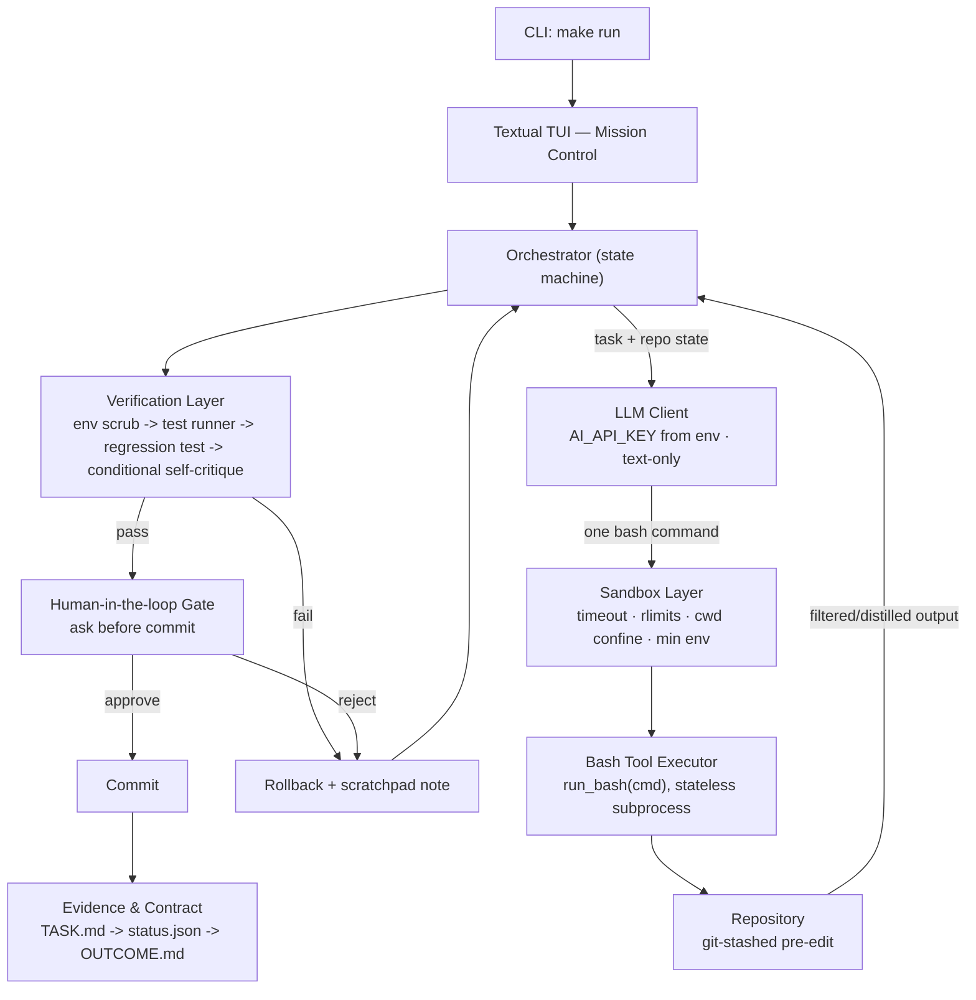
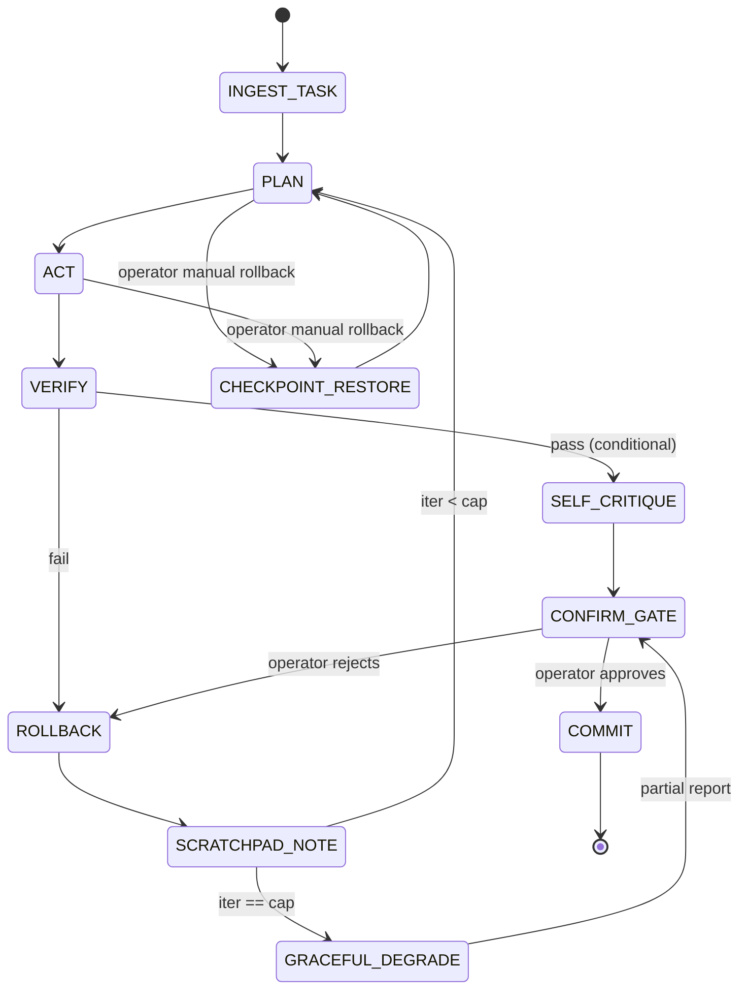
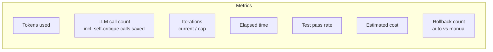

# Otsutsuki

**A proof-first, single-agent coding harness — one model, one tool (`run_bash`), one auditable loop.**

Point it at a local repo, hand it a GitHub issue link or a plain task, and it reproduces the bug, patches it, verifies the patch, and asks you to confirm before committing anything. No hidden state, no multi-agent theater — just a tight loop with a written evidence trail behind every claim of "done."


> Built for the **AI Coding Harness Hackathon 2026** (LCC × DevClub). Every team gets the same foundation model, the same repo, the same issue. The harness is the difference.

---

## Table of contents

- [Philosophy](#philosophy)
- [Problem statement](#problem-statement)
- [What it can do](#what-it-can-do)
- [Architecture](#architecture)
- [Control flow (state machine)](#control-flow-state-machine)
- [Component breakdown](#component-breakdown)
- [Patch-based editing](#patch-based-editing)
- [Context & environment management](#context--environment-management)
- [Optimization layer](#optimization-layer)
- [Efficiency & safety guardrails](#efficiency--safety-guardrails)
- [Sandbox isolation](#sandbox-isolation)
- [Human-in-the-loop: Mission Control TUI](#human-in-the-loop-mission-control-tui)
- [Metrics tracked](#metrics-tracked)
- [Evidence & contract files](#evidence--contract-files)
- [Quickstart](#quickstart)
- [Fixing a GitHub issue end-to-end](#fixing-a-github-issue-end-to-end)
- [Configuration reference](#configuration-reference)
- [Makefile interface](#makefile-interface)
- [Project structure](#project-structure)
- [Security](#security)
- [Goals & success metrics](#goals--success-metrics)
- [Non-goals](#non-goals)
- [Build plan / status](#build-plan--status)
- [Risks & mitigations](#risks--mitigations)
- [Roadmap](#roadmap)
- [License](#license)

---

## Philosophy

**Deterministic execution, auditable evidence, strict resource management.**

One agent, one tool (`run_bash`), one linear-but-prunable history. No multi-agent complexity — every ounce of engineering effort goes into making the single loop reliable, cheap, and provable. The hackathon scores **correctness, evidence, and efficiency** — not architectural sophistication — so Otsutsuki deliberately does not build a planner/executor split, a multi-agent debate system, or a custom search tool. It builds one state machine and makes it hard to fool.

## Problem statement

> Build an autonomous coding-agent harness that can understand a software-engineering task, navigate an existing repository, intelligently use tools, manage context, orchestrate model interactions, recover from failures, and produce correct, verified changes — with efficient use of resources.

## What it can do

| Capability | How |
|---|---|
| **Fix a reported bug / GitHub issue** | Paste an issue or PR URL. Otsutsuki fetches the title, body, and comments, reproduces the failure locally, and patches it. |
| **CRUD / feature work** | Add, change, or remove a field, endpoint, config option, or CLI command. The agent greps for the closest existing pattern and matches it rather than inventing a new style. |
| **General development** | Open-ended "implement X" tasks — confirm current behavior, apply the change, add a test, re-verify nothing adjacent broke. |
| **Plain-language tasks** | No issue link required — describe the task directly against your `TARGET_REPO`. |

---

## Architecture

```
┌────────────────────────────────────────────────────────────┐
│ CLI (make run)  →  Textual TUI (Mission Control)            │
└───────────────────────────┬──────────────────────────────────┘
                             ▼
                  ┌─────────────────────┐
                  │     Orchestrator     │  ← state machine, owns the loop
                  └──────┬───────┬──────┘
              ┌──────────┘       └──────────┐
              ▼                             ▼
   ┌─────────────────────┐        ┌──────────────────────┐
   │      LLM Client       │        │   Bash Tool Executor  │
   │ Anthropic API          │◄──────►│ run_bash(cmd)          │
   │ AI_API_KEY from env    │        │ stateless subprocess   │
   │ text-only, single model│        │ .patch + patch utility │
   └─────────────────────┘        └──────────┬───────────┘
                                              ▼
                                   ┌───────────────────────┐
                                   │     Sandbox Layer        │
                                   │ timeout · rlimits          │
                                   │ cwd confinement · min env    │
                                   │ best-effort net isolation      │
                                   └──────────┬───────────┘
                                              ▼
                                   ┌───────────────────────┐
                                   │      Repository         │
                                   │ git-stashed pre-edit     │
                                   └──────────┬───────────┘
                                              ▼
                     ┌────────────────────────────────────────┐
                     │ Verification Layer                       │
                     │ · env scrub  · test runner                │
                     │ · model-authored regression test           │
                     │ · conditional self-critique ensembler        │
                     └──────────────────┬─────────────────────┘
                                        ▼
                     ┌────────────────────────────────────────┐
                     │ Human-in-the-loop Gate                    │
                     │ ASK BEFORE COMMIT  ·  MANUAL ROLLBACK        │
                     └──────────────────┬─────────────────────┘
                                        ▼
                     ┌────────────────────────────────────────┐
                     │ Evidence & Contract                       │
                     │ TASK.md → status.json → OUTCOME.md          │
                     └────────────────────────────────────────┘
```

Cross-cutting: efficiency guardrails (iteration cap, log distillation, incremental context reload, conditional self-critique) wrap every layer above — checked **before each model call**, not just at the end.

Rendered as a flow, the same system looks like this:



## Control flow (state machine)

```
INGEST_TASK → PLAN → ACT (bash/.patch) → VERIFY
   VERIFY pass → SELF_CRITIQUE? (conditional) → CONFIRM_GATE → COMMIT → DONE
   VERIFY fail → ROLLBACK → SCRATCHPAD_NOTE → retry (if iter < cap) → PLAN
   any state  → operator MANUAL_ROLLBACK → CHECKPOINT_RESTORE → PLAN
   iter == cap → GRACEFUL_DEGRADE → PARTIAL_REPORT → CONFIRM_GATE
```



**Key point:** `CONFIRM_GATE` is a hard stop. The orchestrator does not auto-commit on a green test run — it writes the proposed outcome, surfaces it in the TUI, and waits for operator approval. An `AUTO_APPROVE=1` env flag exists for unattended evaluator runs (see [Configuration reference](#configuration-reference)), and even then the approval step is still logged in `status.json` as auto-approved — the evidence trail always shows it happened.

## Component breakdown

| Component | Responsibility |
|---|---|
| **Orchestrator** | Owns the state machine: plan → act → verify → confirm → commit/rollback |
| **LLM Client** | Single text-only model call surface, reads `AI_API_KEY` from env |
| **Bash Tool Executor** | One tool, `run_bash(cmd)`, stateless `subprocess.run` per call |
| **Sandbox Layer** | Wraps every `run_bash` call: timeout, resource limits, cwd confinement, minimal env, best-effort network isolation |
| **Repository** | Working tree; git-stashed before every model-initiated edit |
| **Verification Layer** | Environment scrub → test runner → regression test → conditional self-critique |
| **Human-in-the-loop Gate** | Confirmation prompt before commit; rollback trigger available anytime |
| **Evidence & Contract** | `TASK.md`, `status.json`, `OUTCOME.md` written across the lifecycle |
| **TUI (Mission Control)** | Agent Manager plan view, Activity/Editor pane, Artifacts bar, metrics |

## Patch-based editing

LLMs reliably mangle quote escaping and indentation on direct file writes. Instead, every code change goes through a real diff:

1. Model writes a unified diff to `/tmp/<n>.patch`.
2. Orchestrator applies it via the `patch` utility.
3. Environment scrub.
4. Test runner.

Self-directed navigation (`grep`, `find`, `cat`) replaces a custom search tool — one less thing to build, one less thing to break.

## Context & environment management

- **Tree-structured context branching** — on tool/test failure, prune back to the last stable state and fork with a synthetic scratchpad note (e.g. *"Attempt 1 failed: syntax error in test runner"*) instead of dragging the failed branch's full output forward.
- **Stateful environment scrubbing** — before every test-runner iteration, kill orphan processes and clear temp caches so no leftover state from a prior attempt corrupts the current validation cycle.
- **Incremental (changed-files-only) reload** — the orchestrator keeps a hash/mtime map of files already in context. Each turn re-sends only files that changed since the last turn — never the whole repo again.
- **Checkpoint & rollback** — `git stash` before every model-initiated edit; both automatic (failed verification) and manual (operator-triggered) rollback restore this checkpoint.

## Optimization layer

| Optimization | Mechanism |
|---|---|
| **Fewer second calls** | Self-critique ensembler is **conditional**, not automatic — only fires on multi-file diffs, diffs over ~15 lines, or after a prior failed attempt. Trivial single-line patches skip straight to testing. |
| **Log distillation** | Instead of blind "last 100 lines" truncation, a filter extracts only exceptions, failed test names/assertions, non-zero exit codes, and the stack-trace tail before feeding output back to the model. |
| **Incremental context reload** | Only changed files are re-sent per turn. |
| **Iteration cap** | Hard stop at 6–8 turns; graceful degradation writes a partial report instead of looping silently. |

## Efficiency & safety guardrails

| Guardrail | Mechanism | Protects |
|---|---|---|
| Iteration cap | Hard stop after N loop turns | Token/cost runaway |
| Conditional self-critique | Skips the ensembler call on trivial patches | Wasted LLM calls |
| Log distillation | Signal-only extraction, not raw truncation | Context bloat, noisy signal |
| Incremental context | Reload only changed files | Redundant tokens |
| Checkpoint/rollback (auto + manual) | `git stash` before edit; revert on failure or operator request | Repo left broken |
| Environment scrubbing | Kill orphans + clear caches before each test run | Cross-attempt corruption |
| Context branching | Prune to last stable state on failure | Context bloat from dead ends |
| Ask-before-commit | Hard confirmation gate | Unreviewed changes landing |
| Sandbox isolation | Timeout, rlimits, cwd confinement, minimal env, best-effort net isolation on every `run_bash` call | Runaway/destructive commands, credential leakage into subprocess env |
| Graceful degradation | Best-effort commit + status note if budget runs out | Silent failure |

## Sandbox isolation

Every `run_bash` call is wrapped, not run as a bare subprocess:

- **Timeout** — hard wall-clock limit per command; a hang counts as a failed action.
- **Resource limits** — CPU time, memory, process count, and file size capped via `resource.setrlimit` (`preexec_fn`).
- **Working-directory confinement** — locked to the repo root; any path resolving outside it is rejected before execution.
- **Minimal environment** — the subprocess gets a stripped-down `env`; `AI_API_KEY` is never passed into a shell the model controls.
- **Best-effort network isolation** — attempts `unshare --net` during edit/test commands, degrading gracefully (never blocking `make setup`/`make run`) if unavailable on the evaluator's machine.
- **Shallow deny-list backstop** — catches obviously destructive commands (`rm -rf /`, `sudo`, `mkfs`, arbitrary `curl`/`wget`). The real containment is timeout + rlimits + cwd confinement, not this list.

A deliberately runaway or destructive test command (an infinite loop, `rm -rf` on a scratch dir) is expected to be killed by the sandbox, not by the harness catching an exception after the fact.

## Human-in-the-loop: Mission Control TUI

Inspired by Google Antigravity's Agent Manager / Editor / Artifacts split, rebuilt terminal-native with Textual. The core idea borrowed from it: **the plan and the proof are always visible, not buried in scrollback.**

```
┌─ AI HARNESS — MISSION CONTROL ──────────────────────────────────────────┐
│ Task: Fix null pointer in auth middleware        Status: ● RUNNING       │
├───────────────────────────┬───────────────────────────────────────────┤
│ AGENT MANAGER (left, 30%) │ ACTIVITY / EDITOR (right, 70%)             │
│                           │                                            │
│ ▸ Plan                    │ [Tabs: Live Log | Diff | Test Output]     │
│  1. ✓ Read issue          │                                            │
│  2. ✓ Locate auth.py      │ $ grep -rn "user.token" src/               │
│  3. ⟳ Write patch          │ src/auth.py:42: if user.token is None:    │
│  4. ○ Run tests            │                                            │
│  5. ○ Self-critique (skip*)│ Applying patch...                         │
│  6. ○ Confirm & commit     │ ✓ patch applied cleanly                   │
│                           │                                            │
│ Iteration: 3 / 8          │ * self-critique auto-skipped: trivial diff │
│ ████████░░░░░░ 42%        │                                            │
│                           │                                            │
│ [R] Rollback   [Q] Quit   │                                            │
├───────────────────────────┴───────────────────────────────────────────┤
│ ARTIFACTS: [TASK.md] [status.json] [OUTCOME.md]  4.2k tok · 3 calls · 38s │
└──────────────────────────────────────────────────────────────────────┘
```

**Confirmation gate** (modal, blocks progress until answered):

```
┌─ CONFIRM COMMIT ──────────────────────────────────────────┐
│ Tests: 6/6 passed · Regression test: PASSED                │
│ Diff: 1 file changed, 4 insertions(+), 1 deletion(-)         │
│                                                              │
│   [ view full diff ]   [ view OUTCOME.md ]                   │
│                                                              │
│              (Y) Commit        (N) Rollback                  │
└──────────────────────────────────────────────────────────┘
```

This modal is the literal implementation of "ask before committing." It does not auto-dismiss. In `AUTO_APPROVE=1` mode it's skipped and logged as an auto-approved transition.

| Panel | Textual widget | Driven by |
|---|---|---|
| Header (task + status dot) | `Header` custom, reactive `status` | Orchestrator state |
| Plan list | `ListView` with icons (✓ ⟳ ○) | Live plan steps; annotates when a step is auto-skipped and why |
| Progress bar | `ProgressBar` | `current_iteration / cap` |
| Activity tabs | `TabbedContent` + `RichLog` / `Syntax` | Distilled log output, `.patch` content, test results |
| Rollback control | `Button` / keybinding `R` | Triggers `orchestrator.manual_rollback()` anytime, independent of auto-rollback |
| Confirm modal | `ModalScreen` | Shown only at `CONFIRM_GATE` |
| Artifacts bar | Buttons swap right pane to `Markdown` widget | Reads `TASK.md`/`OUTCOME.md` off disk; `status.json` pretty-printed |
| Metrics footer | `Static`, reactive, timer-refreshed | Tokens, LLM call count, elapsed time |

**State → color convention:** Running = amber · Verified/committed = green · Failed/rolled back = red · Pending = gray · Auto-skipped = dim/muted with a footnote.

Design choices, in short: the plan is always visible before action happens; the diff is syntax-highlighted, not dumped as raw text, because it's the artifact a judge or operator actually reads; rollback is a first-class control next to Quit, not a hidden recovery path; the confirm modal is the one place in the UI that blocks, by design, because it's the one decision that shouldn't be automatic.

## Metrics tracked

Live in the TUI footer and written to `OUTCOME.md`:



| Metric | What it tells you |
|---|---|
| Tokens used | Running total against budget |
| LLM call count | Includes calls *saved* by the conditional self-critique gate |
| Iterations | Current turn / hard cap |
| Elapsed time | Wall clock for the whole run |
| Test pass rate | Existing suite + the model-authored regression test |
| Estimated cost | Tokens × rate |
| Rollback count | Split out automatic (failed verification) vs. manual (operator-triggered) |

## Evidence & contract files

Every run — success, failure, or degraded — writes:

- **`TASK.md`** — what was asked.
- **`status.json`** — updated at every state transition, so a run can be inspected mid-flight (including sandbox degradation, e.g. network isolation unavailable).
- **`OUTCOME.md`** — test pass/fail matrix, the applied diff, token usage, LLM call count, and rollback count. This file alone should be enough for a judge to understand what happened, without reading raw logs.

---

## Quickstart

```bash
git clone https://github.com/kushalrathore19/Otsutsuki.git
cd Otsutsuki
export AI_API_KEY="your-api-key"
make setup
make run
```

That's the scored minimum bar: `make setup && make run` succeed with **zero manual steps** on a clean checkout.

## Fixing a GitHub issue end-to-end

Otsutsuki operates on a **local clone of the target repository** — separate from the Otsutsuki repo itself — pointed to via `TARGET_REPO`:

```bash
TARGET_REPO=/path/to/your/local/clone make run
```

Once the TUI is running, paste a GitHub issue/PR URL (or plain task text) into the prompt. You can also skip the TUI entirely with the `TASK` env var for scripted or CI-driven runs:

```bash
TARGET_REPO=/path/to/your/local/clone \
TASK="Please fix the bug reported here: https://github.com/owner/repo/issues/123" \
make run
```

What happens next:

1. The ingestion engine recognizes the GitHub URL in the task text.
2. It fetches the issue's title, full description, and comments from the GitHub API.
3. That context is bundled with the task and handed to the LLM agent.
4. The agent uses `grep`/`find` on your `TARGET_REPO` to locate the relevant files, reproduces the bug, and proposes a patch.
5. The patch is verified against the test suite plus a regression test the agent writes for the specific issue.
6. The diff and `OUTCOME.md` summary are presented at `CONFIRM_GATE` — nothing is committed until you approve it.

**Private repositories:** export a personal access token so the harness can authenticate with the GitHub API:

```bash
export GITHUB_TOKEN=your_personal_access_token
```

The token is used only to fetch issue/PR content over the API — it is never passed into the sandboxed shell the model controls, never written to disk, and never appears in `TASK.md`, `status.json`, or `OUTCOME.md`.

## Configuration reference

| Variable | Required | Purpose |
|---|---|---|
| `AI_API_KEY` | Yes | Credential for the foundation model. Read from the environment only — never hard-coded, logged, or committed. |
| `TARGET_REPO` | Yes | Local path to the repository the agent will search, patch, and test. |
| `TASK` | No | Task text or a GitHub issue/PR URL, for non-interactive runs. Omit to enter tasks via the TUI. |
| `GITHUB_TOKEN` | No | Personal access token for fetching issues/PRs from private repositories. |
| `AUTO_APPROVE` | No | Set to `1` to skip the human-approval gate before commit — used for the hackathon's non-interactive evaluation flow. The skipped approval is still logged in `status.json`. Defaults to interactive. |

## Makefile interface

| Command | Purpose |
|---|---|
| `make setup` | Installs and configures every dependency into an isolated virtual environment. Zero manual steps. |
| `make run` | Launches the Textual TUI (or a non-interactive run, depending on `TASK`/`AUTO_APPROVE`). Reads `AI_API_KEY` from env only. |
| `make test` | Runs the harness's own test/evaluation procedure. |
| `make clean` | Removes generated artifacts — `status.json`, temp `.patch` files. |

## Project structure

```
Otsutsuki/
├── Makefile              # setup / run / test / clean
├── src/                  # orchestrator, LLM client, bash tool, sandbox, TUI
├── prd.md                # product requirements — goals, scope, risks
├── architecture.md        # system design — diagrams, control flow, guardrails
├── design.md               # Mission Control TUI design (Textual)
├── rules.md                  # hard constraints — hackathon + engineering
├── phases.md                  # 24-hour build plan
├── memory.md                    # what "memory" means within a single run
├── test_sandbox.py               # sandbox isolation tests
└── .env.example                    # AI_API_KEY= (empty — never a real value)
```

## Security

- The only source of the model credential is the `AI_API_KEY` environment variable, read at runtime.
- No keys, tokens, or secrets are ever present in source code, the Makefile, `.env` files, documentation, or committed config. `.env.example` ships with empty values only.
- `GITHUB_TOKEN`, when used, is scoped to the GitHub API fetch step only and never reaches the sandboxed shell the model controls.
- Nothing the harness writes to disk — logs, `status.json`, `OUTCOME.md`, patches — ever contains a credential.
- `.gitignore` excludes `.env`; the repo was grepped for hard-coded credential strings before every phase was marked done.

## Goals & success metrics

| Goal | Metric | Priority |
|---|---|---|
| Correctness | Issue resolved; model-authored regression test + existing suite pass | P0 |
| Reproducibility | `make setup && make run` succeed on a clean machine, zero manual steps | P0 |
| Evidence over claims | `TASK.md` / `status.json` / `OUTCOME.md` fully populated every run | P0 |
| Efficiency | Tokens, LLM call count, wall-clock time per resolved task | P0 |
| Failure recovery | % of runs that self-correct or cleanly rollback without human help | P1 |
| Human control | User can rollback or halt before a commit at any point | P0 |
| Security | Zero hardcoded credentials anywhere in the repo | P0 |

**Users & stakeholders:** the **evaluator** clones the repo, runs the standardized Makefile flow, and feeds the prescribed GitHub issue — never touching source or config. The **organizing committee** defines the model, environment, and scoring policy. The **operator** (you, during a run) watches Mission Control, can manually roll back, and must approve the final commit.

## Non-goals

Explicitly out of scope for this build:

- Multimodal input handling (image, audio, video).
- Multi-agent orchestration, agent debate, or voting.
- Cross-run persistent memory — each evaluation run is self-contained (see `memory.md` for what "memory" means *within* a single run).
- Substituting a different model than the one prescribed, without Organizing Committee authorization.

## Build plan / status

Built as a 24-hour execution plan, prioritized so a working CLI harness that passes tests always beats a beautiful TUI that doesn't:

| Phase | Hours | Focus | Done when |
|---|---|---|---|
| 0 | 0–2 | Makefile + env wiring | `make setup && make run` succeeds on a clean venv |
| 1 | 2–7 | Bare agent loop | Model runs one `run_bash` call against the repo, output visible |
| 2 | 7–11 | Patch workflow + sandbox | A patch applies cleanly; a runaway/destructive command gets killed by the sandbox |
| 3 | 11–15 | Verification + recovery loop | A failing test triggers rollback + a useful retry note, not a repeated mistake |
| 4 | 15–18 | Optimization layer | Re-running the same task uses fewer tokens/calls the second time |
| 5 | 18–20 | Human-in-the-loop gate | You can watch a run reach "ready to commit," say no, and see a clean rollback |
| 6 | 20–22 | Mission Control TUI | Plan list updates live, diff tab renders the real patch, confirm gate is a modal |
| 7 | 22–23 | Evidence artifacts + clean-env test | `OUTCOME.md` alone explains the run to a judge, no logs needed |
| 8 | 23–24 | Buffer / final polish | Credential grep, `make clean` check — only if everything above is done |

## Risks & mitigations

| Risk | Mitigation |
|---|---|
| Harness fails to launch in a clean environment | Full clean-VM test of `make setup && make run` before submission |
| Confirmation gate blocks unattended evaluator runs | `AUTO_APPROVE` env flag for the evaluator's non-interactive path; default stays interactive for demo/judging |
| Over-engineering eats build time | Ship the working loop first; treat Phase 5+ as stretch if behind schedule |
| Accidental credential commit | `.gitignore` for `.env`; `.env.example` ships empty |

## Roadmap

Results are expected roughly 7–10 days after evaluation. Promising repos may continue through LCC × DevClub post-hackathon, so this is built for maintainability, not just demo day:

- Multi-file, multi-issue batch runs against a single `TARGET_REPO`
- Pluggable model backends behind the same `AI_API_KEY` config surface
- Richer TUI: live diff preview refinements, per-iteration cost breakdown

## License

Add your license here before publishing.
